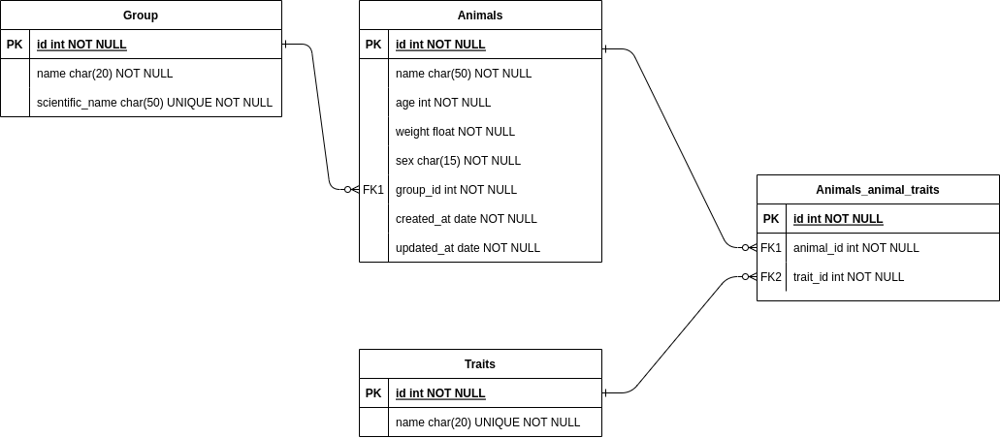

# Kenzie Pet - API em Python, Django + DRF

Esta API foi construída utilizando Python, Django e Django Rest Framework para simular um pequeno CRUD de animais, com seu respectivo grupo e características.

## Diagrams

